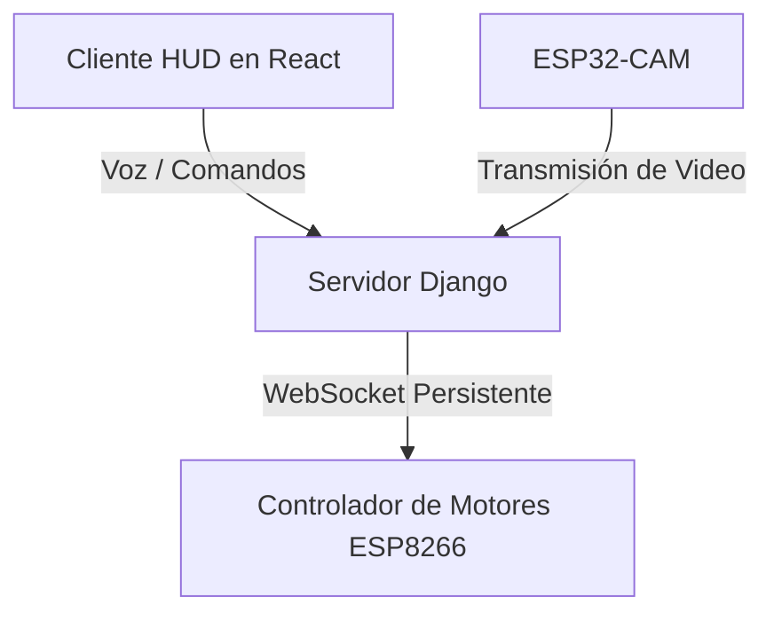

# Sistema Rover CAM32

Un panel de control web completo y un sistema increible de backend para un robot móvil controlado por ESP32-CAM y ESP8266. El sistema cuenta con control por voz offline, detección de personas mediante YOLOv8, estacionamiento autónomo basado en códigos QR y seguimiento de objetos por color.

---

##  Stack Tecnológico

- **Backend:** Django para procesamiento de visión artificial en tiempo real con OpenCV, YOLOv8 y control de voz con modelo de IA local.
- **Frontend:** Aplicación moderna e interactiva desarrollada por completo en **Vite + React + TypeScript** usando **Tailwind CSS** para un diseño fluido y de alto rendimiento en tiempo real.

---

##  Características Principales

### 1. Interfaz de Control HUD en React
- Capa de diseño tecnológico futurista que muestra la transmisión de la cámara en vivo, diagnósticos de telemetría y registros del sistema de forma reactiva.
- Panel de control direccional integrado y calibración de Gamepad USB en pantalla de forma nativa.
- Superposiciones personalizadas: banner de misión completada, localizadores de objetivos y retículas de alineación.

### 2. Modos de Conducción e Inteligencia

*   **MANUAL:** Control total mediante botones táctiles y soporte de teclado/gamepad sobre el movimiento del robot.
*   **AI:** Detección y segmentación de personas en tiempo real superpuesta en el video con YOLOv8.
*   **AI - 2 :**
    - El robot realiza un escaneo circular para registrar todos los códigos QR visibles.
    - Elige una casita al azar entre los detectados.
    - Gira, se alinea, avanza y se estaciona de forma totalmente autónoma en la casita seleccionada.
    - Muestra un botón flotante de "Nueva Misión" al finalizar para reiniciar la dinámica.
*   **AUTO:**
    - Filtro de segmentación por color HSV ajustado para reconocer y seguir una tapita de botella azul.
    - Se alinea horizontalmente y mantiene al robot a una distancia constante.
    - Si pierde de vista el objetivo, el robot se detiene inmediatamente por seguridad.

### 3. Control por Voz Offline (VUI)
- Integra el reconocedor de voz offline con modelo Vosk cargado localmente.
- Grabador local en JS que envía audio a Django sin necesidad de conexión a internet.
- Los comandos de voz en inglés y español.

### 4. Conexión WebSocket Persistente 
- Hilo keep-alive en segundo plano integrado en Django.
- Envía pings de control cada 3 segundos para asegurar la salud del canal.
- Reconexión automática instantánea ante caídas de señal, ofreciendo una latencia de control inferior a 5ms.

---

##  Arquitectura del Sistema



---

##  Configuración e Instalación

### Requisitos Previos
- Python 3.11+
- Node.js (para levantar el servidor de desarrollo de Vite)

### 1. Configuración del Backend (Django)
Navega a la carpeta `backend-rover`:
```bash
cd backend-rover
```

Crea un entorno virtual y actívalo:
```bash
python -m venv venv
venv\Scripts\activate
```

Instala las dependencias necesarias:
```bash
pip install -r requirements.txt
```

Asegúrate de colocar la carpeta del modelo de voz `vosk-model-en-us-0.22-lgraph` dentro del directorio `backend-rover/`.

Inicia el servidor Django:
```bash
python manage.py runserver 0.0.0.0:8001
```

### 2. Configuración del Frontend (Vite + React)
Navega a la carpeta `frontend-rover`:
```bash
cd ../frontend-rover
```

Instala las dependencias de Node:
```bash
npm install
```

Arranca el servidor de desarrollo Vite:
```bash
npm run dev
```
Y abre la ruta en tu navegador: **`http://localhost:5173/`**

---

## Configuración de Puertos e IPs

- **Dirección IP del ESP8266:** Configurada por defecto en `192.168.1.99` (Puerto `81` para el canal WebSocket).
- **Ruta de Video del ESP32-CAM:** Configurada en `http://192.168.1.171:81/stream` dentro de las vistas de Django.
- **Códigos de Movimiento Enviados:**
  - `F`: Avanzar (Forward)
  - `B`: Retroceder (Backward)
  - `L`: Girar Izquierda (Left)
  - `R`: Girar Derecha (Right)
  - `S`: Detenerse (Stop)
  - `H`: Bocina/Claxon (Horn)
