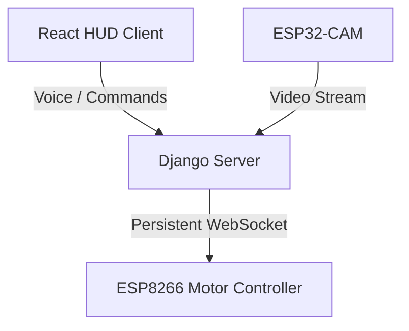

# Rover CAM32 System

A complete web control panel and an amazing backend system for a mobile robot controlled by ESP32-CAM and ESP8266. The system features offline voice control, person detection using YOLOv8, autonomous QR-based parking, and color-based object tracking.

---

## Technology Stack

- **Backend:** Django for real-time computer vision processing with OpenCV, YOLOv8 and voice control with a local AI model.
- **Frontend:** Modern and interactive application developed entirely in **Vite + React + TypeScript** using **Tailwind CSS** for a fluid and high-performance real-time design.

---

## Key Features

### 1. React HUD Control Interface
- Futuristic tech design layer showing live camera feed, telemetry diagnostics, and system logs reactively.
- Integrated directional control panel and native on-screen USB Gamepad calibration.
- Custom overlays: mission completed banner, target locators, and alignment crosshairs.

### 2. Driving Modes and Intelligence

*   **MANUAL:** Full control via touch buttons and keyboard/gamepad support over the robot's movement.
*   **AI:** Real-time person detection and segmentation overlaid on the video using YOLOv8.
*   **AI - 2:**
    - The robot performs a circular scan to register all visible QR codes.
    - Chooses a random house among the detected ones.
    - Turns, aligns, moves forward, and parks completely autonomously in the selected house.
    - Displays a floating "New Mission" button at the end to restart the sequence.
*   **AUTO:**
    - HSV color segmentation filter adjusted to recognize and follow a blue bottle cap.
    - Aligns horizontally and keeps the robot at a constant distance.
    - If it loses sight of the target, the robot stops immediately for safety.

### 3. Offline Voice Control (VUI)
- Integrates the offline voice recognizer with a locally loaded Vosk model.
- Local JS recorder that sends audio to Django without requiring an internet connection.
- Voice commands in English and Spanish.

### 4. Persistent WebSocket Connection
- Background keep-alive thread integrated into Django.
- Sends control pings every 3 seconds to ensure connection health.
- Instant auto-reconnection upon signal drops, offering less than 5ms control latency.

---

## System Architecture



---

## Setup and Installation

### Prerequisites
- Python 3.11+
- Node.js (to run the Vite development server)

### 1. Backend Setup (Django)
Navigate to the `backend-rover` directory:
```bash
cd backend-rover
```

Create a virtual environment and activate it:
```bash
python -m venv venv
venv\Scripts\activate
```

Install the required dependencies:
```bash
pip install -r requirements.txt
```

Make sure to place the `vosk-model-en-us-0.22-lgraph` voice model folder inside the `backend-rover/` directory.

Start the Django server:
```bash
python manage.py runserver 0.0.0.0:8001
```

### 2. Frontend Setup (Vite + React)
Navigate to the `frontend-rover` directory:
```bash
cd ../frontend-rover
```

Install Node dependencies:
```bash
npm install
```

Start the Vite development server:
```bash
npm run dev
```
And open the URL in your browser: **`http://localhost:5173/`**

---

## Port and IP Configuration

- **ESP8266 IP Address:** Configured by default to `192.168.1.99` (Port `81` for the WebSocket channel).
- **ESP32-CAM Video Stream:** Configured to `http://192.168.1.171:81/stream` inside Django's views.
- **Sent Movement Codes:**
  - `F`: Forward
  - `B`: Backward
  - `L`: Turn Left
  - `R`: Turn Right
  - `S`: Stop
  - `H`: Horn
